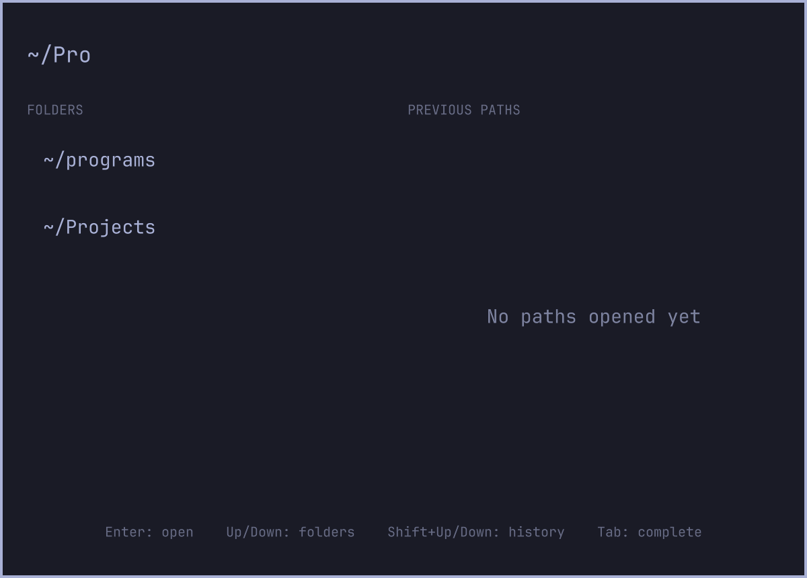

# Agent Folder Picker for Omarchy

A native, keyboard-first folder picker that launches the configured Omarchy
coding agent in the selected directory. It runs inside the existing Omarchy
Shell process and follows the active Omarchy theme.



## Features

- Filesystem folder autocomplete with five visible matches.
- A separate list of recently opened folders.
- Launches the default Omarchy agent, including OpenCode, Claude Code, Codex,
  Grok, Gemini, GitHub Copilot, Crush, Pi, and Oh My Pi.
- Mouse and keyboard navigation.
- XDG-compliant local history with a maximum of 30 unique paths.
- Home-directory paths are displayed using `~`.

## Requirements

- Omarchy 4.0 or newer with the Quattro shell plugin system.
- A default coding agent configured through Omarchy.

The runtime uses `bash`, `find`, `realpath`, `flock`, `uwsm-app`,
`xdg-terminal-exec`, and `omarchy-agent`. These are provided by Omarchy and its
base system; the plugin downloads nothing and installs no packages.

Set or change the default agent with, for example:

```bash
omarchy default agent codex
```

## Install

Install and enable the plugin from its public repository:

```bash
omarchy plugin add https://github.com/Alront/agent-folder-picker-for-omarchy.git --enable
```

Add the contents of [`examples/bindings.lua`](examples/bindings.lua) to
`~/.config/hypr/bindings.lua`, then validate Hyprland:

```bash
hyprctl reload
hyprctl configerrors
```

The example binds the picker to `Super+Alt+A`, which is unused by stock Omarchy
at the time of publication. Choose another key if you already use that
combination. The corresponding IPC command
is:

```bash
omarchy-shell shell toggle io.github.alront.agent-folder-picker '{}'
```

## Usage

- Type to filter folders in the current path segment.
- `Up` / `Down`: select an autocomplete result.
- `Shift+Up` / `Shift+Down`: select a previously opened path.
- `Tab`: complete the selected folder.
- `Enter`: launch the default agent in the typed or selected folder.
- `Escape`: clear the input, then close the picker.

Recent paths are stored in
`${XDG_STATE_HOME:-~/.local/state}/omarchy/agent-folder-picker/paths`.
History is best-effort: an unwritable state directory does not prevent an agent
from launching. Folder names containing newline characters are not supported.

## Update

```bash
omarchy plugin update io.github.alront.agent-folder-picker
```

## Remove

Remove the binding from `~/.config/hypr/bindings.lua`, then run:

```bash
omarchy plugin remove io.github.alront.agent-folder-picker
```

Removing the plugin does not remove its history file. Delete the state path
shown above if you also want to erase recent-folder history.

## Development

Validate the manifest and run the script tests:

```bash
omarchy plugin validate .
QMLLINT=$(command -v qmllint || printf /usr/lib/qt6/bin/qmllint)
"$QMLLINT" -I "${OMARCHY_PATH:-/usr/share/omarchy}/shell" AgentFolderPicker.qml
./tests/test-scripts.sh
```

The plugin does not request elevated privileges, install packages, download
code, or run a second Quickshell process. Like every Omarchy Shell plugin, its
QML and helper scripts run unsandboxed with the current user's permissions.

## License

MIT. See [`LICENSE`](LICENSE).
